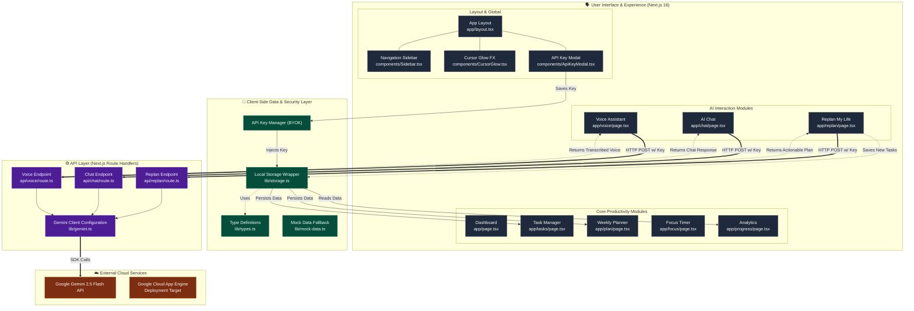

# ⚡️ Syntra

> **From Thought to System:** An AI-powered productivity platform that transforms messy human thoughts into structured, actionable systems.

[](https://nextjs.org/)
[](https://www.typescriptlang.org/)
[](https://tailwindcss.com/)
[](https://ai.google.dev/)

Syntra is a state-of-the-art productivity hub designed to intelligently sort, prioritize, and structure your daily chaos. Utilizing modern web features and on-device storage, Syntra gives you full control over your data with zero lock-in and zero compromises.

## ✨ Key Features

### 🎯 Core Productivity Hub
- **Dynamic Dashboard:** Real-time stats, active tasks, and system overview at a glance.
- **Task Manager:** Full CRUD capabilities with advanced category and priority filtering.
- **Weekly Planner:** 7-day interactive calendar grid with color-coded time blocking.
- **Focus Mode:** Pomodoro-style timer with integrated task selection and session logging.
- **Progress Analytics:** Beautiful visual charts tracking completion rates, streaks, and focus metrics.

### 🧠 AI-Powered by Gemini 2.5 Flash
- **Replan My Life:** Brain-dump your chaos—Syntra automatically structures it into actionable tasks and a precise schedule.
- **AI Chat:** An context-aware productivity assistant with full conversation history.
- **Voice AI:** Natural speech-to-text interaction paired with text-to-speech responses for hands-free productivity.

### 🛡️ Ironclad Data Privacy
- **100% Client-Side Storage:** All your data safely resides within your browser's local storage.
- **BYOK (Bring-Your-Own-Key):** Use your personal Gemini API key. It's stored securely and *only* in your browser.
- **Zero Cloud Database:** No external databases. No telemetry. Your data is yours.

## 🚀 Getting Started

### Prerequisites
- Node.js 18.x or later
- A Google Gemini API Key

### Installation

1. **Clone the repository:**
   ```bash
   git clone https://github.com/omshukla24/Sybtra.git
   cd Sybtra
   ```

2. **Install dependencies:**
   ```bash
   npm install
   ```

3. **Configure Environment:**
   Create a `.env.local` file in the root directory and add your key (optional, can also be configured via UI):
   ```bash
   echo "GEMINI_API_KEY=your_key_here" > .env.local
   ```

4. **Run the local development server:**
   ```bash
   npm run dev
   ```

5. **Open in Browser:**
   Navigate to [http://localhost:3000](http://localhost:3000)

## ☁️ Deployment

Syntra is optimized for deployment on Google Cloud App Engine.

```bash
# Build and deploy directly to GCP
npm run deploy
```

## 🏗️ Project Architecture

### System Architecture Diagram



### Directory Structure

```plaintext
app/
├── api/              # Route handlers for AI, Chat, and Voice
├── chat/             # AI Assistant interface
├── focus/            # Deep-work Pomodoro timer
├── plan/             # Weekly blocking and scheduling
├── progress/         # Analytics and charts
├── replan/           # Chaos-to-system AI tool
├── settings/         # BYOK management
├── tasks/            # Core task management
└── voice/            # Voice-first AI interaction
components/           # Reusable UI elements, modals, and layouts
lib/                  # Core utilities (Gemini client, local storage wrapper, types)
```

## 🛠️ Built With

- **[Next.js](https://nextjs.org/)** — React Framework
- **[Google Gemini](https://ai.google.dev/)** — AI Model powering insights
- **[Google Cloud App Engine](https://cloud.google.com/appengine)** — Deployment target
- **[Framer Motion](https://www.framer.com/motion/)** — Fluid UI animations
- **[Tailwind CSS](https://tailwindcss.com/)** — Utility-first styling

---

<p align="center">
  <b>Syntra</b> — Handcrafted to turn your thoughts into an unbreakable system.
</p>
